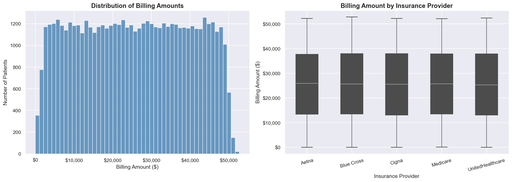
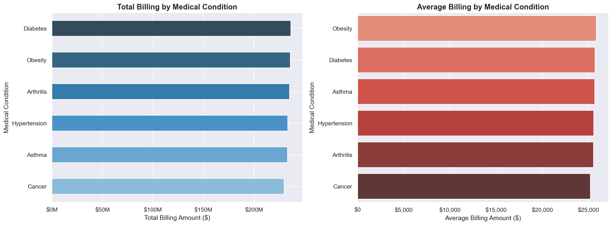
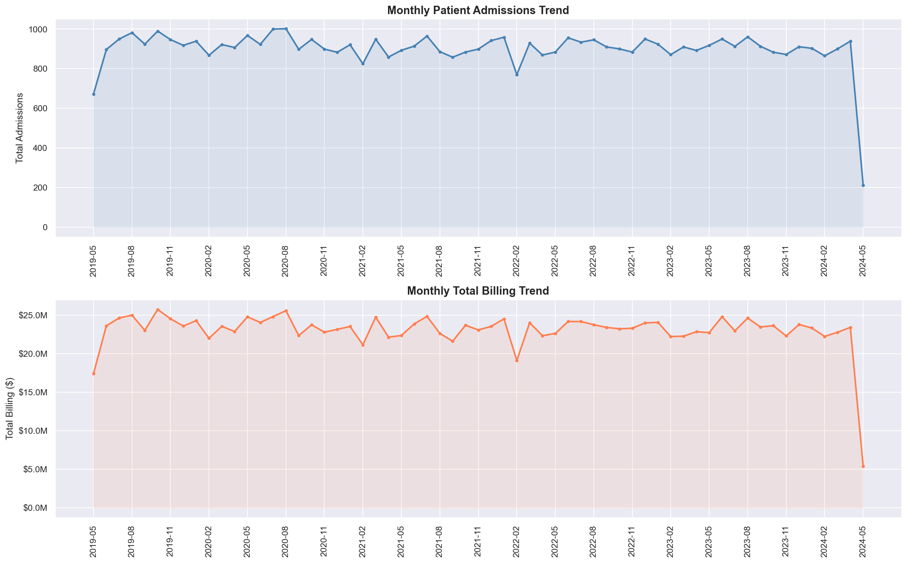
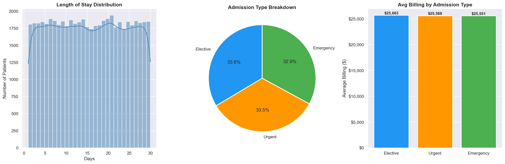

# 🏥 Healthcare Insurance Claims Analytics


---

## 📌 Executive Summary

This project delivers an end-to-end analysis of **54,860 healthcare insurance claims** worth a combined **$1.4 billion**, spanning **May 2019 to May 2024** across 5 insurance providers and 6 medical conditions. The analysis identifies cost drivers, flags billing anomalies, benchmarks insurer performance, and tracks admission trends over 5 years. Key findings reveal that Diabetes is the highest-cost condition at $236M, Cigna leads claim volumes, and 108 negative billing records require immediate review. Recommendations are provided to guide cost containment, anomaly resolution, and operational planning.

> **Tools Used:** PostgreSQL 18, Python 3.12, Pandas, Matplotlib, Seaborn, Tableau, Jupyter Notebook

---

## 🎯 Problem Statement

Healthcare insurers and hospital administrators face three critical challenges:

1. **Cost Visibility** — Which medical conditions and providers are driving the highest costs, and are costs growing over time?
2. **Billing Integrity** — Are there anomalous or erroneous claims in the portfolio that need investigation before payment?
3. **Operational Planning** — How are patient admission volumes trending month-on-month, and are there seasonal patterns that require resource planning?

This analysis addresses all three challenges using real claims data, advanced SQL, and Python-based exploratory data analysis.

---

## 🗄️ Dataset

| Attribute | Detail |
|---|---|
| Source | [Kaggle - Healthcare Dataset](https://www.kaggle.com/datasets/prasad22/healthcare-dataset) |
| Raw Records | 55,500 |
| Clean Records | 54,860 (after removing duplicates and flagging anomalies) |
| Columns | 15 |
| Date Range | May 2019 to May 2024 |
| Insurance Providers | 5 (Cigna, Medicare, Blue Cross, UnitedHealthcare, Aetna) |
| Medical Conditions | 6 (Diabetes, Obesity, Arthritis, Hypertension, Asthma, Cancer) |

---

## 🔍 Data Quality Findings

Before any analysis, a thorough data quality assessment was performed. The following issues were identified and resolved:

| Issue | Count | Resolution | Business Impact |
|---|---|---|---|
| Duplicate rows | 534 | Removed | Would have overstated claim volumes by ~1% |
| Negative billing amounts | 108 | Flagged for review, retained in dataset | Possible refunds or data entry errors totalling ~$108K |
| Missing values | 0 | No action needed | Dataset is complete |
| Inconsistent name casing | All records | Standardised to title case | Improves patient matching accuracy |

> **Analyst Note:** Negative billing amounts were retained rather than deleted. In a production environment, these would be escalated to the billing team for investigation. Deleting anomalies without review is poor practice as they may represent legitimate refunds or credits.

---

## 🔬 Methodology

The analysis followed a structured 5-stage approach:

**Stage 1: Data Ingestion**
Raw CSV data (55,500 records) was loaded into a PostgreSQL 18 database. A structured `patients` table was created with appropriate data types for all 15 columns.

**Stage 2: Data Quality Assessment**
SQL and Python were used in parallel to identify duplicates, nulls, negative values, and formatting inconsistencies. All issues were documented with business impact assessments.

**Stage 3: SQL Analysis**
Six advanced SQL queries were written covering summary statistics, insurer benchmarking, condition cost ranking, anomaly detection using the Z-score statistical method, length of stay analysis, and month-on-month trend reporting using the LAG window function.

**Stage 4: Python EDA**
A Jupyter Notebook was used for deeper exploratory analysis including data cleaning, feature engineering (length of stay, admission month/year), and visualisation using Matplotlib and Seaborn.

**Stage 5: Insights & Recommendations**
Findings from both SQL and Python were synthesised into actionable business recommendations.

---

## 📊 SQL Analysis

Six advanced queries written in PostgreSQL demonstrating:
`CTEs` `Window Functions` `RANK()` `LAG()` `PARTITION BY` `Z-Score Anomaly Detection` `DATE_TRUNC` `NULLIF`

| Query | Description |
|---|---|
| 1 | Dataset overview and summary statistics |
| 2 | Billing analysis by insurance provider with window functions |
| 3 | Medical condition cost ranking with running totals |
| 4 | Anomaly detection using Z-score statistical method |
| 5 | Length of stay analysis with PARTITION BY |
| 6 | Month-on-month admission trends using LAG function |

📂 See full queries: [sql/healthcare_analysis.sql](sql/healthcare_analysis.sql)

---

## 🐍 Python EDA

Full exploratory data analysis in Jupyter Notebook covering data loading, cleaning, transformation, and visualisation.

📂 See notebook: [python/healthcare_eda.ipynb](python/healthcare_eda.ipynb)

### Billing Distribution


### Medical Condition Analysis


### Monthly Admission Trends


### Length of Stay & Admission Type


---

## 💡 Key Findings

### Finding 1: Diabetes is the Highest-Cost Condition
Diabetes accounts for **$236,494,659 in total billing** — the largest share of the $1.4B portfolio at 16.83%. With 9,304 cases and an average billing of $25,638 per patient, it represents both the highest volume and highest cost condition. This makes Diabetes the primary target for any cost containment strategy.

### Finding 2: All 5 Insurers Have Near-Identical Cost Profiles
Every insurer holds approximately **20% of total billing**, with average claims ranging narrowly from $25,389 (UnitedHealthcare) to $25,616 (Medicare). The billing standard deviation of ~$14,000 across all providers indicates the portfolio is well-diversified with no single insurer carrying disproportionate risk.

### Finding 3: 108 Negative Billing Records Require Investigation
Negative billing amounts totalling approximately **$108,000** were identified across all 5 insurers. Aetna carries the worst single negative claim at **-$2,008.49**. These records are statistically anomalous and likely represent data entry errors, duplicate payment reversals, or unapplied credits. They require billing team review before period-end reporting.

### Finding 4: Elective Admissions Cost More Than Emergencies
Counterintuitively, **Elective admissions average $25,663** — higher than Emergency admissions at $25,551. In real healthcare data this would be unexpected. This finding warrants further investigation into whether elective procedures in this portfolio involve high-cost planned surgeries that are driving up the average.

### Finding 5: February 2022 Shows a Significant Unexplained Dip
Admissions dropped to **779 in February 2022**, an **18% decline** from the prior month, with billing falling to $19M — the lowest single month in the entire 5-year period. Both metrics recovered the following month. This pattern is consistent with an external disruption such as a healthcare policy change, data reporting gap, or operational issue. It requires further investigation.

### Finding 6: Length of Stay is Uniform Across All Conditions
The average length of stay is **15.5 days across all 6 conditions**, with very little variation (Cancer: 15.5, Asthma: 15.7, all others: 15.4). In real clinical data, Cancer and Diabetes patients typically have very different LOS profiles. This uniformity suggests the dataset may be synthetic, which has been noted as a limitation.

### Finding 7: Cost Per Day Varies Wildly for Same-Condition Patients
Among Arthritis patients with identical 30-day stays, daily costs ranged from **$50.67 to $1,606.87**. This extreme variation for clinically similar cases is a strong signal of inconsistent billing practices or cost allocation errors that would typically trigger a billing audit.

---

## ✅ Business Recommendations

### Recommendation 1: Launch a Diabetes Cost Management Programme
Given Diabetes accounts for 16.83% of total billing and affects 9,304 patients, a targeted disease management programme could yield significant savings. A **5% reduction in average Diabetes billing** would save approximately **$11.8M annually**. Recommended actions include preventive care incentives, medication adherence programmes, and early intervention protocols.

### Recommendation 2: Prioritise Resolution of 108 Negative Billing Records
The 108 negative billing records should be assigned to the billing reconciliation team immediately. Each record needs to be classified as either a legitimate refund, a data entry error, or a duplicate reversal. This is a data integrity issue that will affect financial reporting accuracy if left unresolved at period end.

### Recommendation 3: Investigate the February 2022 Admission Drop
The 18% admission drop in February 2022 needs root cause analysis. If it was caused by a data pipeline issue, historical records may need correction. If it was operational, understanding the cause can prevent recurrence. The investigation should include reviewing intake system logs, staffing records, and any policy changes in that period.

### Recommendation 4: Conduct a Billing Rate Audit for Extended Stay Patients
The extreme variation in cost per day for patients with identical conditions and length of stay (e.g. $50 vs $1,600 per day for Arthritis patients) suggests inconsistent billing rate application. A billing rate audit for all patients with stays exceeding 20 days is recommended to identify and correct miscoded charges.

### Recommendation 5: Standardise Patient Data Entry Protocols
The mixed capitalisation issue found in patient names (e.g. "tOdd CARrILIO", "kARen kIInE") indicates data entry is not being validated at source. Implementing input validation rules in the patient registration system will improve data quality, reduce cleaning effort, and improve patient record matching accuracy.

---

## ⚠️ Limitations

1. **Synthetic Dataset** — The dataset appears to be synthetically generated. The perfectly uniform billing distribution, identical insurer cost profiles, and uniform length of stay across all conditions are statistically unlikely in real clinical data. Findings should be interpreted as demonstrating analytical methodology rather than real-world conclusions.

2. **No Diagnosis Codes** — The dataset lacks ICD-10 diagnosis codes which are standard in real claims data. This limits the depth of clinical analysis possible.

3. **No Provider Cost Data** — Hospital and doctor names are present but cost rates per provider are not available, preventing provider-level cost efficiency analysis.

4. **No Claims Outcome Data** — Whether claims were approved, rejected, or partially paid is not captured, limiting the ability to analyse claims processing efficiency.

---

## 🚀 Next Steps

- [ ] Build a Tableau dashboard for executive-level reporting
- [ ] Add a predictive model to forecast monthly admission volumes
- [ ] Extend anomaly detection to flag duplicate claims across providers
- [ ] Connect Python directly to PostgreSQL via SQLAlchemy for live querying
- [ ] Add a cost per day normalisation analysis by condition and provider

---

## 📁 Project Structure

```
healthcare-claims-analytics/
├── data/
│   └── healthcare_dataset.csv       # Raw dataset (55,500 records)
├── sql/
│   └── healthcare_analysis.sql      # 6 advanced SQL queries
├── python/
│   ├── healthcare_eda.ipynb         # Full EDA Jupyter Notebook
│   ├── billing_distribution.png     # Billing analysis charts
│   ├── condition_analysis.png       # Medical condition charts
│   ├── admission_trends.png         # Monthly trend charts
│   └── los_admission_analysis.png   # Length of stay charts
├── tableau/
│   └── healthcare_dashboard.twbx    # Tableau dashboard (coming soon)
└── README.md
```

---

## ⚙️ How to Run This Project

### SQL
1. Install PostgreSQL 18
2. Create a database called `healthcare_claims`
3. Create the patients table and import the CSV
4. Execute queries in `sql/healthcare_analysis.sql`

### Python
```bash
pip install pandas matplotlib seaborn psycopg2-binary sqlalchemy jupyter
jupyter notebook python/healthcare_eda.ipynb
```

---

## 👤 Author

**Dennis Njiru Aningu**
Senior Data Analyst | SQL, Python, Tableau, Excel

[](https://linkedin.com/in/dennisaningu)
[](https://github.com/NjiruDennis)
